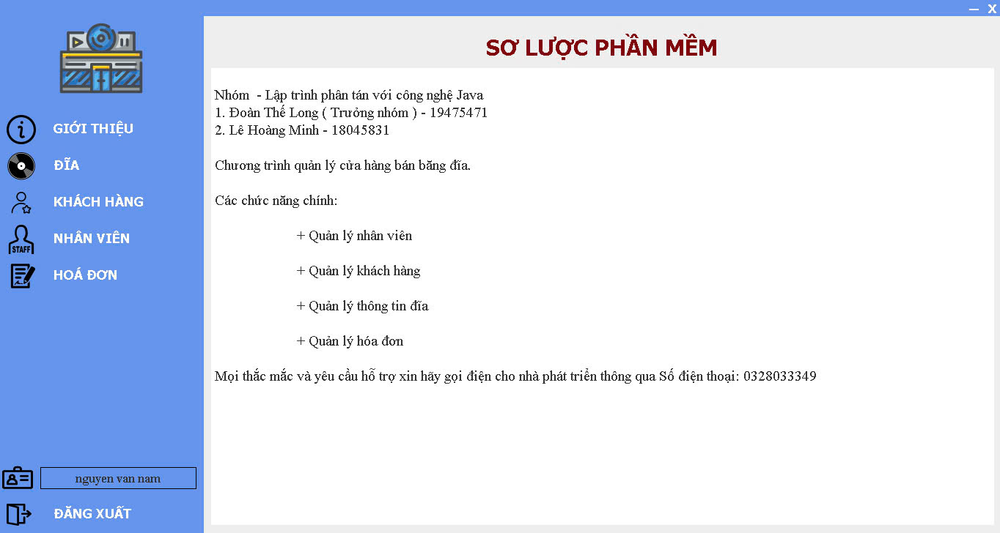
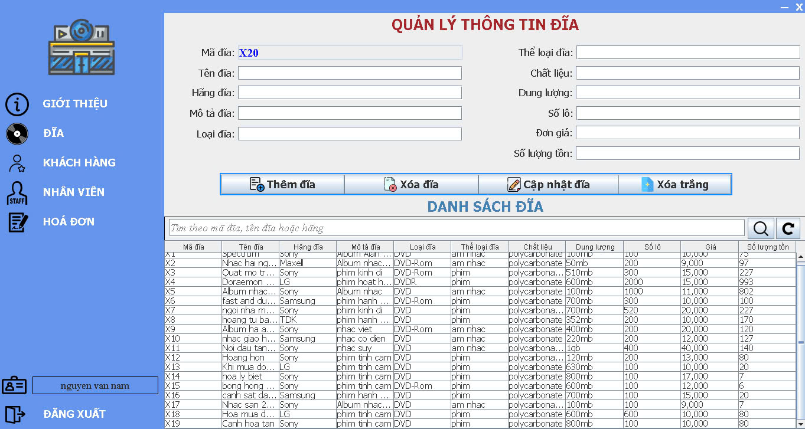
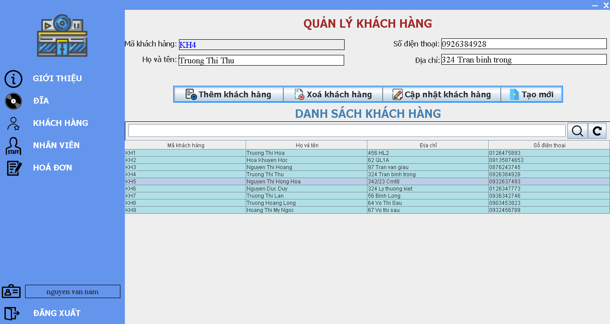
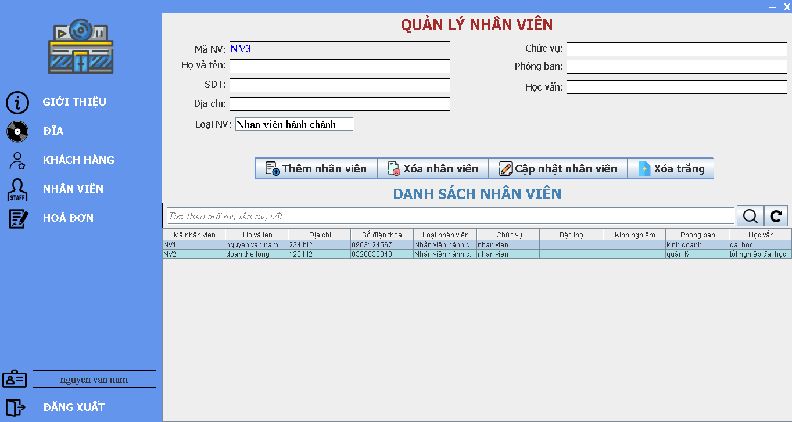
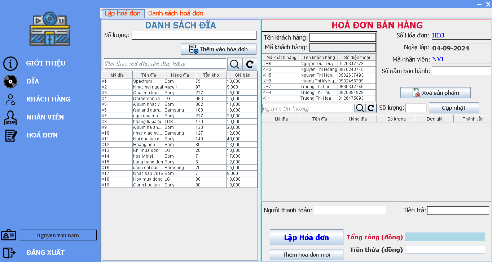

# Disc-Manager
### I. Decription
- This is software that supports disc sales management with 2 main users:
- *`Administrative Staff` has permissions: Disc management, customer management, invoice management*
- *`Manager` has full permissions*
### II. Functions
- Disc management:
	- Add Disc
	- Delete Disc
	- Edit Disc information
	- Search for Disc (By ID)
- Employee management:
	- Add employee
	- Delete employee
	- Edit employee information
	- Search for employee (By ID, name or Phone)
- Customer management:
	- Add customer
	- Delete customer
	- Edit customer information
	- Search for customer by code (By customer ID, name)
- Invoice management:
	- Create invoice
	- Search for invoice (By invoice ID)
### III. Technologies Used
- GUI:
	- Java Swing ([WindowBuilder](https://eclipse.dev/windowbuilder/))
- Programming language:
	- Java ([JDK 1.8](https://www.oracle.com/java/technologies/javase/javase8-archive-downloads.html))
- Database:
	- MongoDB
- API:
	- RMI
- Architecture:
	- Client-Server
- Tool:
	- Eclipe
	- Github 	
### IV. Installation Guide
- Step 1: Clone the code from GitHub.
- Step 2: Create a database with collections similar to those in the `hibernate.cfg.xml` file.
- Step 3: Open the `ServerApp.java` and `ClientApp.java` files, and modify the `RMI IP` to match the `IP of your machine`.
- Step 4: Configure `JRE` to version `1.8_202`.
- Step 5: Open the `data file` and import it into your database.
- Step 6: Run `ServerApp.java` first, and then run `ClientApp.java`.
### V. Some images of the software interface
- Main Interface  

- Disc Manager Interface  

- Customer Manager Interface

- Employee Manager Interface

- Invoice Manager Interface
	- Create Invoice Interface  

	- List Invoice Interface

